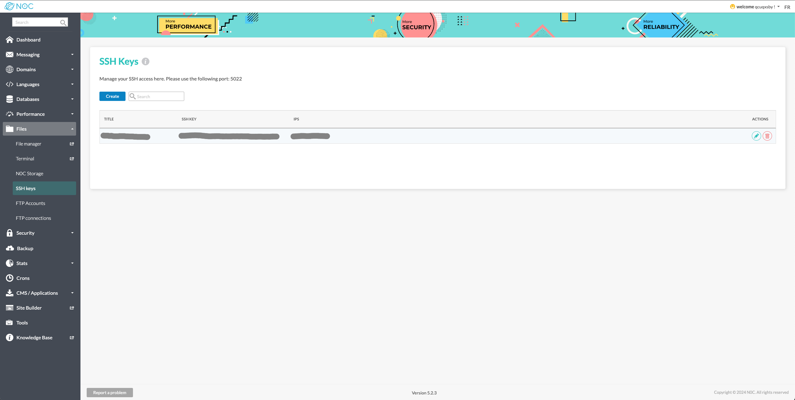
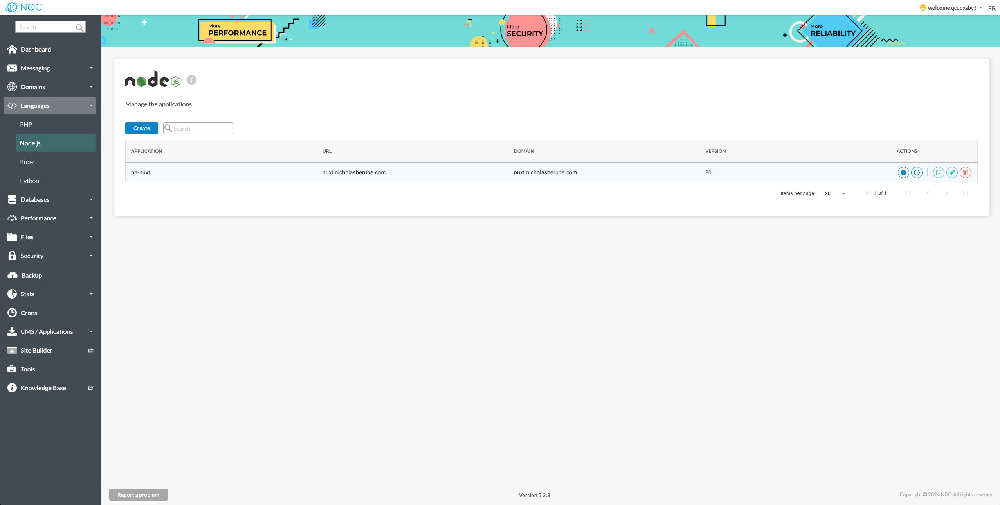
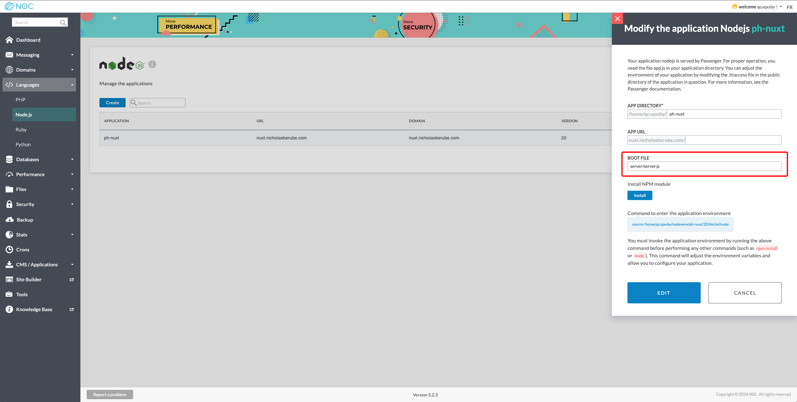
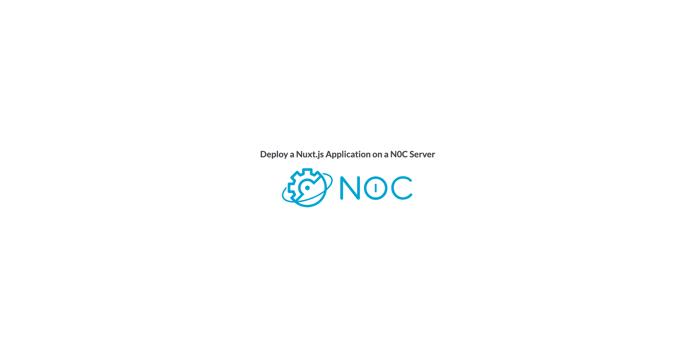

# Nuxt 3 Minimal Starter with N0C Deploy Script 🚀

<div>
   
</div>
<br>
<div>
   
</div>
<br>
Welcome to the Nuxt 3 Minimal Starter! This guide will help you deploy your Nuxt.js application on <a href="https://www.planethoster.com/en/World-Hosting">N0C hosting</a>  effortlessly. Follow along for a seamless deployment experience. 

For more information on Nuxt 3, check out the [Nuxt 3 documentation](https://nuxt.com/docs/getting-started/introduction).

Demo: [https://nuxt.n0c.xyz](https://nuxt.n0c.xyz/)

## Requirements

- Node.js >= 18.0.0.
- NPM

## Setup

1. **Clone the Repository**

   Clone this repository to your local machine. [Learn more](https://docs.github.com/en/github/creating-cloning-and-archiving-repositories/cloning-a-repository-from-github/cloning-a-repository)

2. **Install Dependencies**

   Install the required dependencies using NPM:

   ```bash
     npm install
   ```
   
3. **Configure SSH Connection**

   Set up an SSH connection to your N0C hosting. [Learn how](https://kb.n0c.com/en/knowledge-base/how-to-create-an-ssh-key-and-connect-to-an-account/)

   

4. **Set Up Node.js Application on N0C**

   Create and configure your Node.js application on N0C hosting. [Learn more](https://kb.n0c.com/en/knowledge-base/nodejs-application-management/)
   
   

   **Important:** During the application creation step, specify the following JavaScript entry file:
   `server/server.js`

   

5. **Configure Environment Variables**

   Copy and rename the `.env-sample` file to `.env`. Enter the required variable values.

   ```bash
   USERNAME=myusername
   IP=XXX.XX.XXX.XXX
   PORT=5022
   APPLICATION_NAME="ph-nuxt"
   DIRECTORY_PATH="/home/myusername/ph-nuxt"
   STARTUP_FILE="server/server.js"
   NODE_VERSION=20
   ```

6. **Deploy Your Application**

   Run the deploy command:

   `npm run deploy`

## About the Deploy Script
- Runs the build command
- Sets environment variables
- Restarts the application

The web server `Passenger` on N0C does not support `.mjs`files.
The deploy script creates a `server.js` file in the `server` directory that imports the `index.mjs` to bypass this limitation.
It also removes the `package.json` file from the `server` directory.

## Video Demonstration

In this demo, I explain how to manually deploy a Nuxt.js application on N0C without using the deployment script.

<a href="https://vimeo.com/1011383078/6f7d832d96?ts=0&share=copy" target="_blank">
  
</a>

Enjoy deploying your Nuxt.js application with ease!
